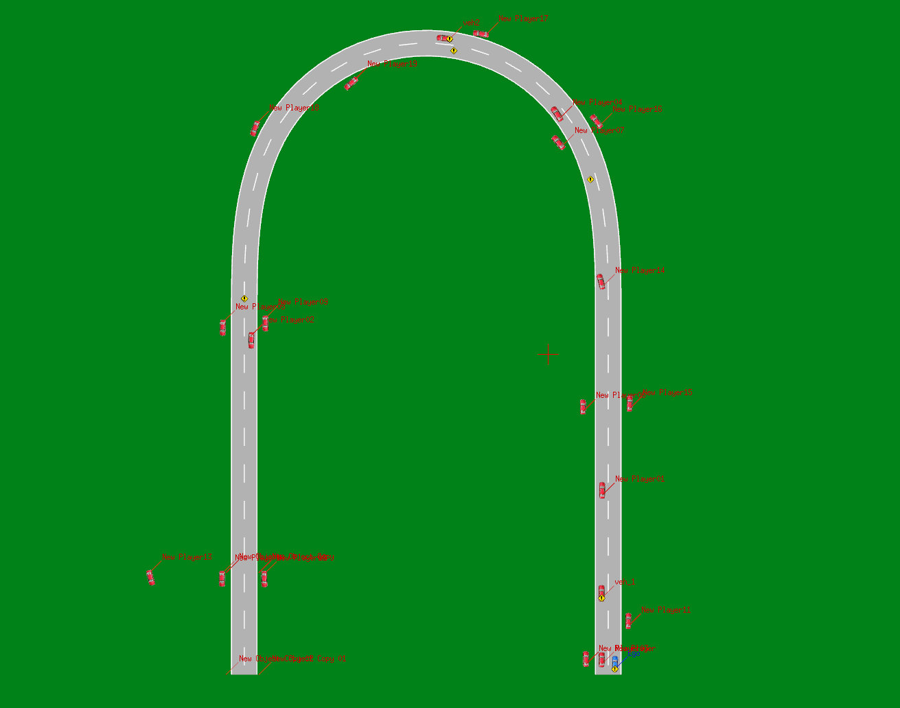

# a project of VTD
## env
1. ubuntu20.04
2. ros
3. matplotlibcpp
4. yaml-cpp
5. osqp (in the ./thirdparty)
6. osqp-eigen(in the ./thirdparty)
7. eigen
8. VTD2022
## lib
1. VtdRosConnector

upzip the ./other/VtdRosConnector.zip， as the ros package

the workspace will be like 
```
ros_ws
├── build
├── devel
└── src
    ├── CMakeLists.txt
    ├── test_ctrl
    └── VtdRosConnector
```
then make it

## VTD setup
the scenarios file is in the other/ac_2023
copy the file to the VTD install path just like
```
/VIRES/VTD.2022.4/Data/Projects/algorithmCompetition_2023/Scenarios/ac_2023
```
- `ac_juesai_ltest.xml、ac_juesai_rtest.xml` is for last competition scenarios


- `lat_lon.xml` is for the lateral and longtitude MPC algorithm control verification


